## Training-free Stylized Text-to-Image Generation with Fast Inference <br><sub>Official PyTorch Implementation</sub>


[](https://arxiv.org/abs/2505.19063) 
[](https://maxin-cn.github.io/omnipainter_project/)

> [**Training-free Stylized Text-to-Image Generation with Fast Inference**](https://maxin-cn.github.io/omnipainter_project/)<br>
> [Xin Ma](https://maxin-cn.github.io/), [Yaohui Wang*](https://wyhsirius.github.io/), [Xinyuan Chen](https://scholar.google.com/citations?user=3fWSC8YAAAAJ), [Tien-Tsin Wong](https://ttwong12.github.io/myself.html), [Cunjian Chen*](https://cunjian.github.io/) <br>
> (*Corresponding authors)

This repo contains sampling code of OmniPainter. Please visit our [project page](https://maxin-cn.github.io/cinemo_project/) for more results.

<!--
In this project, we propose a novel stylized image generation method leveraging a pre-trained large-scale diffusion model without requiring fine-tuning or any additional optimization, termed as OmniPainter. Specifically, we exploit the self-consistency property of latent consistency models to extract the representative style statistics from reference style images to guide the stylization process. Additionally, we then introduce the norm mixture of self-attention, which enables the model to query the most relevant style patterns from these statistics for the intermediate output content features. This mechanism also ensures that the stylized results align closely with the distribution of the reference style images.
-->
 
<div align="center">
    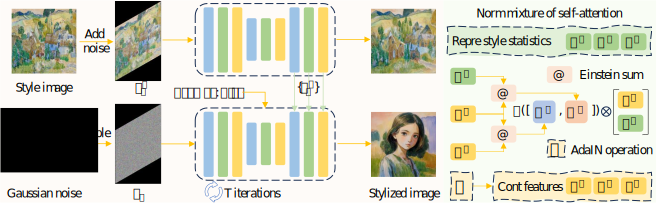
</div>


## News

- 🔥 **May. 17, 2025** 💥 The related codes are released.

## Setup

Download and set up the repo:

```bash
git clone https://github.com/maxin-cn/OmniPainter
cd OmniPainter
conda env create -f environment.yml
conda activate omnipainter
```

## Stylized image generation

You can sample high-quality images that match both the given prompt and the style reference image within just 4 to 6 timesteps, without requiring any inversion. The script has various arguments for adjusting sampling steps, changing the classifier-free guidance scale, etc:

```bash
bash run.sh
```

Related model weights will be downloaded automatically and following results can be obtained,

<table style="width:100%; text-align:center;">
<tr>
  <td align="center">Style images</td>
  <td align="center" colspan="3">Generated Images</td>
</tr>
<tr>
  <td align="center">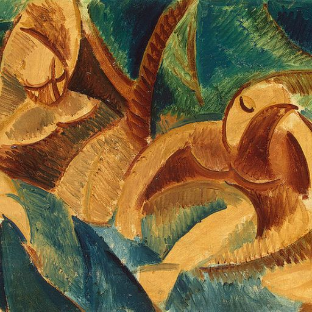</td>
  <td align="center">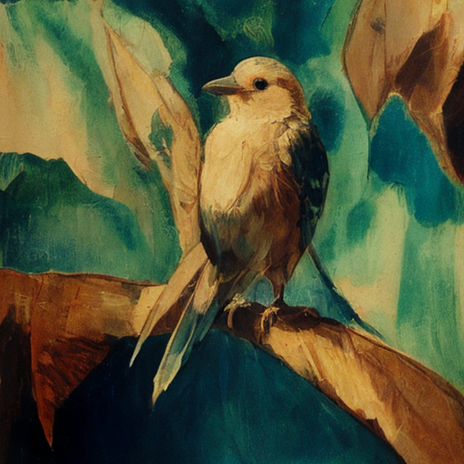</td>
  <td align="center">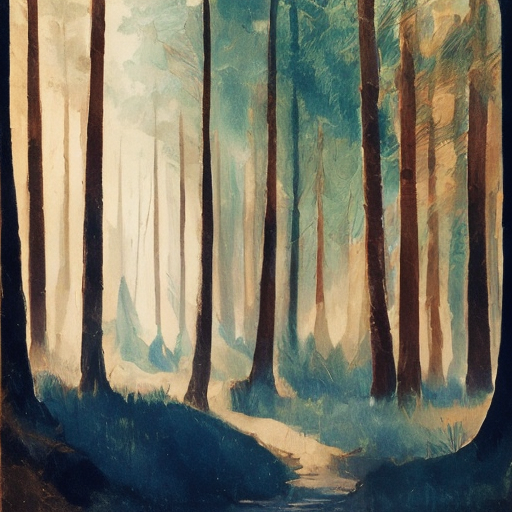</td>
  <td align="center">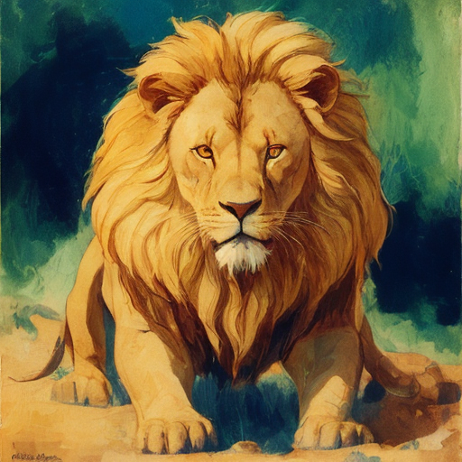</td>
</tr>

<tr>
  <td align="center">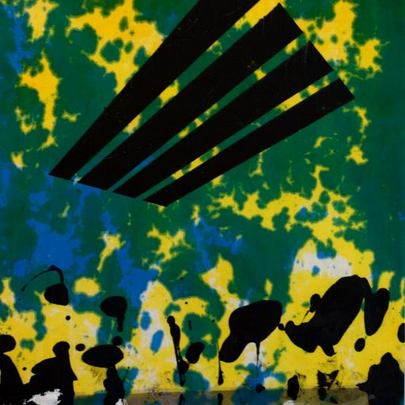</td>
  <td align="center">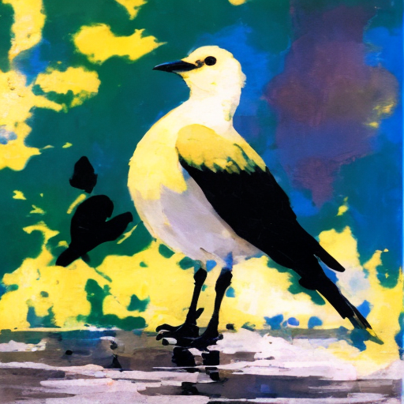</td>
  <td align="center">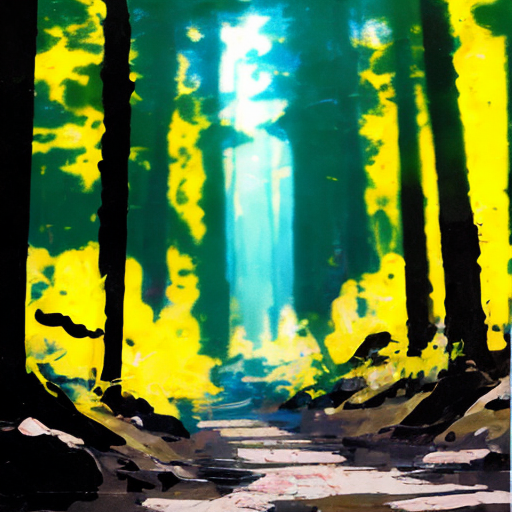</td>
  <td align="center">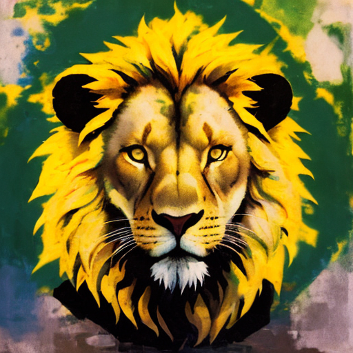</td>
</tr>

<tr>
  <td align="center">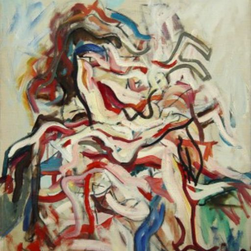</td>
  <td align="center">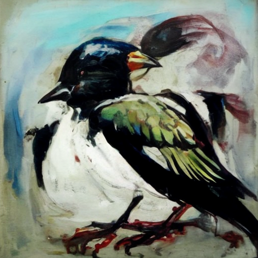</td>
  <td align="center">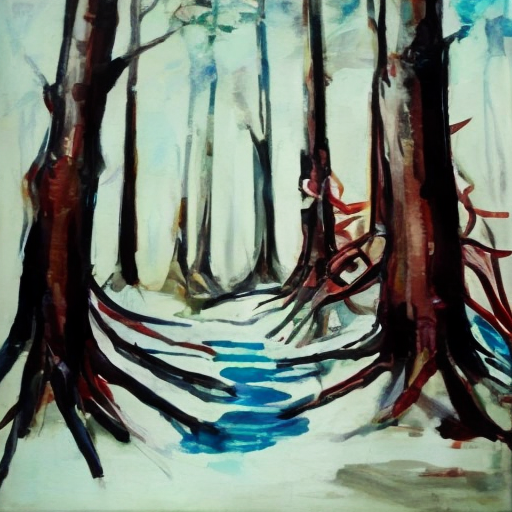</td>
  <td align="center">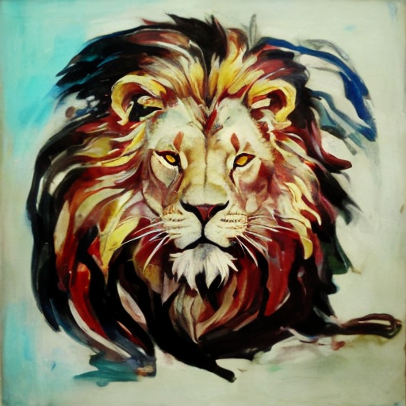</td>
</tr>

<tr>
  <td align="center">Reference</td>
  <td align="center">"Bird"</td>
  <td align="center">"Forest"</td>
  <td align="center">"Lion"</td>
</tr>

</table>

## Contact Us
Xin Ma: xin.ma1@monash.edu,
Yaohui Wang: wangyaohui@pjlab.org.cn 

<!-- ## Citation
If you find this work useful for your research, please consider citing it.
```bibtex
@article{ma2024cinemo,
  title={Cinemo: Consistent and Controllable Image Animation with Motion Diffusion Models},
  author={Ma, Xin and Wang, Yaohui and Jia, Gengyun and Chen, Xinyuan and Wong, Tien-Tsin and Li, Yuan-Fang and Chen, Cunjian},
  journal={arXiv preprint arXiv:2407.15642},
  year={2024}
}
``` -->


## Acknowledgments
OmniPainter has been greatly inspired by the following amazing works and teams: [Prompt-to-Prompt](https://github.com/google/prompt-to-prompt), [latent-consistency-model](https://github.com/luosiallen/latent-consistency-model), [ZePo](https://github.com/liujin112/ZePo), [Z∗](https://github.com/HolmesShuan/Zero-shot-Style-Transfer-via-Attention-Rearrangement) and [MasaCtrl](https://github.com/TencentARC/MasaCtrl). we thank all the contributors for open-sourcing.


## License
The codes are licensed under [LICENSE](LICENSE).
